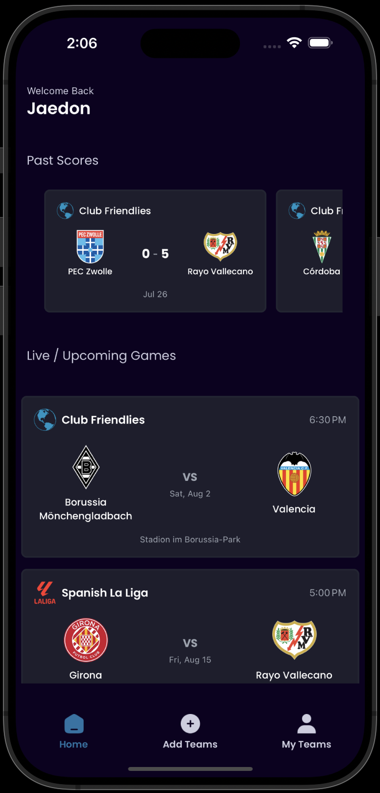
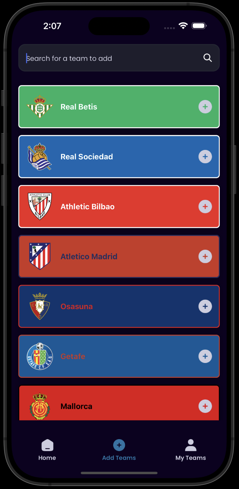
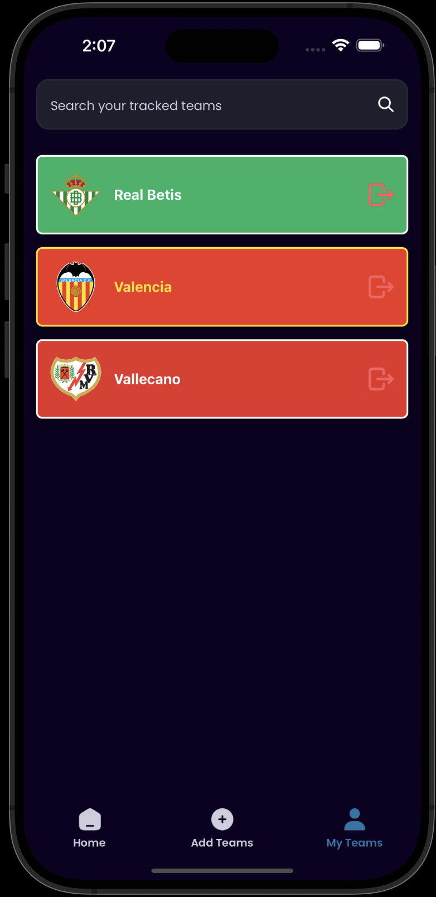

# OmniFan

**Follow all your favorite sports teams in one place — across leagues, across the world.**

## 📱 What is OmniFan?

**OmniFan** is a React Native app built for multi-sport fans. Tired of switching between apps just to keep up with your favorite soccer clubs, NBA teams, and NFL squads? OmniFan unifies them all.

- Track teams across leagues (e.g., NBA, NFL, NHL, Premier League, La Liga, etc.)
- See scores from recent games
- Get notified about upcoming games
- Customize your feed based on your favorite teams

## 🔧 Features

- 🔍 Add and follow favorite teams from multiple sports and leagues  
- 📅 See upcoming fixtures  
- 📊 View recent results  
- 🔔 Get notifications before game time (coming soon)  
- 🌐 Supports global teams and leagues

## 🛠️ Built With

- [React Native](https://reactnative.dev/)  
- [Expo](https://expo.dev/)  
- [Firebase](https://firebase.google.com/) – authentication and backend  
- [TheSportsDB API](https://www.thesportsdb.com/) – live sports data (teams, fixtures, results)

## 🚀 Getting Started

1. Clone the repo  
   ```bash
   git clone https://github.com/Jsatchell03/omnifan.git
   cd omnifan
    ```
2. Install dependencies
    ```bash
    npm install
    ```
3. Start the app
    ```bash
    npm start
    ```
    Until the app is publicly realsed you will need your own API key and database to run the app

## Screenshots





